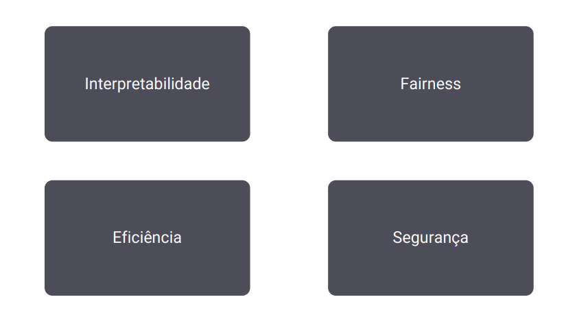

### Fundamentos de aprendizado de máquina

O objetivo deste módulo é apresentar alguns conceitos fundamentais que farão parte de toda jornada de projeto ligado a aprendizado de máquina (machine learning). Através destes conceitos, será possível entender melhor o landscape de algoritmos e técnicas para se lidar com projetos de Machine Learning, bem como estar atento a possíveis desafios que irão emergir e como superá-los, em temas como redução de dimensionalidade, overfitting e underfitting, dentre outros.

#### O que é

O aprendizado de máquina (machine learning, em inglês) é um campo da Inteligência Artificial que trata do modo como os sistemas utilizam algoritmos e dados para simular a maneira de aprender dos seres humanos, com melhora gradual e contínua por meio da experiência.

Os algoritmos que são construídos aprendem com os erros de forma automatizada, com o mínimo de intervenção humana e após treinados (ou “ensaiados”) conseguem identificar padrões, fazer previsões, tomar decisões, tudo isso, com base nos dados coletados.

#### Tipos de aprendizado

- Supervisionado: Modelos são treinados usando um conjunto de dados rotulado, aprendendo a mapear entradas para saídas esperadas.
- Não supervisionado: Modelos exploram dados não rotulados para identificar padrões ou estruturas subjacentes, como agrupamentos, associações ou redução de dimensionalidade.
- Semi Supervisionado: Combina dados rotulados e não rotulados para melhorar o desempenho do modelo, geralmente utilizando a estrutura não rotulada para aprimorar o aprendizado supervisionado.
- Por reforço: Agentes aprendem a tomar ações em um ambiente para maximizar algum tipo de recompensa acumulativa, através de tentativa e erro

#### Aprendizados

#### Tipos de algoritmos

#### A maldição da dimensionalidade

A Maldição da Dimensionalidade foi denominada pelo matemático R. Bellman em seu livro “Programação Dinâmica” em 1957. A maldição da dimensionalidade diz que a quantidade de dados de que você precisa, para alcançar o conhecimento desejado, impacta exponencialmente o número de atributos necessários.

Em resumo refere-se a uma série de problemas que surgem ao trabalhar com dados de alta dimensão. A dimensão de um conjunto de dados corresponde ao número de características existentes em um conjunto de dados.

- Como lidar? Com seleção de features ou Redução de Dimensionalidade (Com base num conjunto de dados, você aplicar um algoritmo que na verdade combina essas features, numa feature única que na verdade traz a informação dessas features, invés de colocar várias features, você irá colocar apenas uma, onde é uma representação delas).

#### Engenharia e seleção de features

A engenharia de features é uma etapa fundamental no processo de desenvolvimento de modelos de machine learning. Refere-se ao processo de selecionar, extrair, transformar ou criar novas variáveis (features) a partir dos dados brutos para melhorar o desempenho dos modelos. Uma boa engenharia de features pode tornar um modelo mais preciso, eficiente e interpretável. 

A engenharia de features é um processo iterativo. Os especialistas em IA/ML geralmente começam com um conjunto inicial de features e então testam diferentes combinações de features para determinar a melhor configuração para o modelo.

#### Overfitting e Underfitting

- Underfitting: ocorre quando um modelo de aprendizado de máquina é muito simples para aprender a relação entre as variáveis nos dados de treinamento. Isso pode resultar em um modelo que não é capaz de fazer previsões precisas para dados novos.

- Overfitting: ocorre quando um modelo de aprendizado de máquina aprende a relação entre as variáveis nos dados de treinamento com muito detalhe, incluindo o ruído nos dados. Isso pode resultar em um modelo que é capaz de fazer previsões precisas para os dados de treinamento, mas não é capaz de generalizar para dados novos.

##### Como lidar?

1. Regularização
2. Ensemble de modelos
3. Seleção de features
4. Redução de dimensionalidade
5. Validação cruzada

#### Trade-off entre Viés e Variância

O Trade-off entre viés e variância descreve a relação entre a capacidade de um modelo de aprender a partir de dados e sua capacidade de generalizar para dados novos.

Viés é o erro sistemático que um modelo comete ao aprender a partir de dados. Ele ocorre quando o modelo não é capaz de aprender a relação real entre as variáveis.

Variância é a variabilidade dos resultados de um modelo ao ser aplicado a diferentes conjuntos de dados. Ele ocorre quando o modelo é muito complexo ou quando os dados de treinamento são insuficientes.

- Baixo Viés e Baixa Variância: É o modelo ideal e o que desejamos obter, com uma boa acurácia e precisão nas previsões

- Baixo Viés e Alta Variância: O modelo está superestimando (overfitting) nos dados de treino e não generaliza bem com dados novos.

- Alto Viés e Baixa Variância: O modelo está subestimando (underfitting) nos dados de treino e não captura a relação verdadeira entre as variáveis preditoras e a variável resposta.

- Alto Viés e Alta Variância: O modelo está inconsistente e com um acurácia muito baixa nas previsões.

#### Validação de modelos

Hold-out: Separar, de forma aleatória, uma parcela dos dados para testar o modelo, e utilizar o restante para treinamento. Ou seja, os testes são feitos com dados que o modelo não viu anteriormente. Ideal para conjuntos pequenos e quando há restrição no tempo de treinamento.

K-Fold: Na validação cruzada, o dataset é dividido aleatoriamente em “K” grupos e a cada iteração, um grupo é selecionado como conjunto de teste (validação) e os demais para treinamento. No final, teremos a métrica de cada iteração e quando estamos satisfeitos com a performance, aplicamos no conjunto final de testes. Ideal para grandes conjuntos e necessidade de mais precisão.

Stratified K-Fold: Segue o mesmo conceito do K-Fold, mas aplicado a problemas de classificação, onde queremos manter a distribuição dos dados entre as classes em cada Fold, tanto no treinamento quanto na Validação e Teste. Ideal para datasets desbalanceados.

Tão importante quanto escolher o modelo para o seu problema, é saber selecionar as métricas que seu modelo está no caminho certo. A escolha da métrica deve levar em conta não apenas o modelo, mas a estrutura dos dados e tipo de problema a ser resolvido.

Durante a etapa inicial de entendimento do problema, é importante obter quais métricas do negócio serão impactadas pelas decisões geradas pelos modelos de IA, para que estas métricas possam ser validadas após ter estes modelos em produção, avaliando a necessidade de ajustes e ou aplicação de novas abordagens.

##### Questões não funcionais

- Interpretabilidade: conseguir explicar porque o modelo está retornando aquele resultado.
- Fairness: como garantir que nosso modelo está sendo justo em diversas situações de diversidade, passa muito pela seleção de dados de entrada.
- Eficiência: tanto no processo de treinamento quanto no processo de inferência, se eu tenho um modelo que demora muito tempo para ser treinado, você tem que ficar reitreinando esse modelo a todo instante, esse modelo ele demora para fazer isso, esse é um aspecto que tenho que considerar.
- Segurança: como meu modelo trata e protege os dados que estão sendo usados, como garantir que aquele dado não vai usado para outra finalidade.

#### Ensemble de Modelos

Ensemble de modelos é uma técnica de aprendizado de máquina que combina as previsões de vários modelos para melhorar o desempenho geral. Essa técnica é baseada no princípio de que a combinação de modelos pode ajudar a reduzir o viés e a variância, o que pode levar a previsões mais precisas.

Essas técnicas são frequentemente usadas em competições de aprendizado de máquina, onde a combinação de modelos pode dar uma vantagem crítica. No entanto, vale a pena notar que os ensembles podem aumentar a complexidade e o tempo de treinamento, portanto, é sempre bom considerar o trade-off entre performance e complexidade.

#### Tipos de ensemble de modelos

#### Estrutura de Projetos de IA/ML

A adoção de uma metodologia para projetos de IA/ML é essencial para estruturar e padronizar o processo de desenvolvimento, assegurando que cada fase seja abordada de forma sistemática e abrangente. Uma abordagem metódica não só facilita a identificação e correção de falhas, como o overfitting, mas também promove a reprodutibilidade, permitindo que outros cientistas e engenheiros de dados repliquem o trabalho com facilidade.

Além disso, essa estruturação otimiza a iteração e aprimoramento do modelo, e facilita a documentação e a comunicação com as partes interessadas, garantindo transparência, colaboração e eficiência ao longo de todo o projeto.

##### CRISP-DM
Cross Industry Standard Process for Data Mining

Foi criada em 1996 e se tornou a metodologia mais difundida em ciência de dados para uso em projetos de IA/ML. O CRISP-DM é cíclico, significando que é comum retornar a etapas anteriores conforme avançamos no projeto, permitindo refinamentos contínuos até alcançar o resultado desejado. Seu uso com métodos Lean geram entregas de valor para o Cliente, no conceito de “Fail Fast, Learn Faster”

##### ML Canvas

Foi criada em 2016 como uma ferramenta para ajudar equipes e stakeholders a planejar e comunicar os aspectos centrais de um projeto de machine learning de maneira clara e concisa.

O conceito foi inspirado no Business Model Canvas, mas adaptado especificamente para os desafios e componentes únicos dos projetos de machine learning.

O ML Canvas tem sido usado por profissionais da área para estruturar e planejar iniciativas de ML, ajudando a garantir que todos os elementos-chave sejam considerados e entendidos por todas as partes envolvidas.

##### AI Canvas

Foi criado em 2018 por professores da Universidade de Toronto com o objetivo de ajudar as pessoas a tomarem melhores decisões e a estruturarem projetos com a ajuda de IA/ML.

Também usa uma estrutura similar ao Business Model Canvas, mas dá um enfoque maior na questão humana, capturando o julgamento que será feito sobre as predições, as ações que precisam de predições e o feedback para melhoria contínua do modelo.

